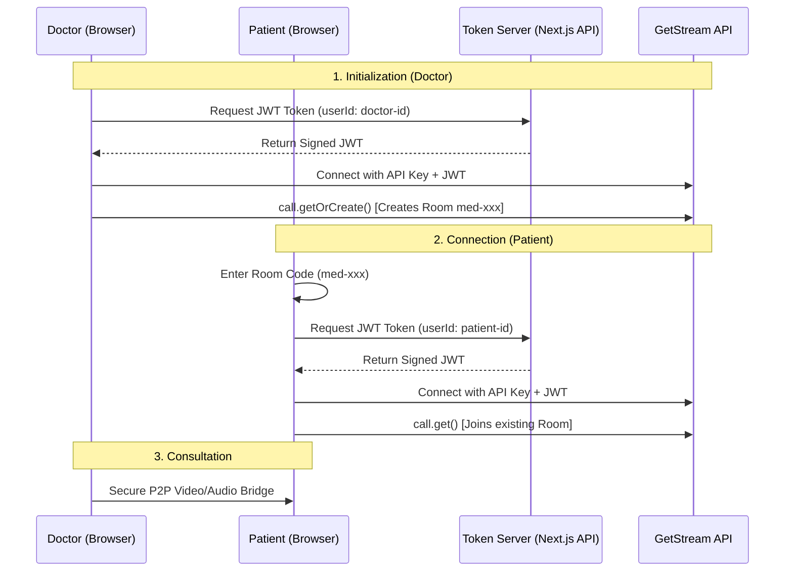

# GetStream Video Consultation: Full Feature Flow

This documentation outlines the complete architecture and implementation of the Stream Video consultation feature for **Flux Telemedicine**.

## 1. High-Level Architecture
The system follows a secure, server-side authenticated flow to prevent unauthorized room creation and ensure data privacy.

---

## 2. Step-by-Step Implementation Flow

### Step A: The Token Provider (`/api/token`)
We use a server-side API to generate JWT tokens. This keeps the `STREAM_SECRET` hidden from the client.
- **Library**: `@stream-io/node-sdk`
- **Method**: `client.generateUserToken({ user_id, exp })`
- **Why?**: Stream's security policy prevents "Guest" roles from creating calls. Tokens grant specific users the right to create or join.

### Step B: Clinical Room Initialization ([RoomPage](file:///e:/DEV/Vs%20Code%20Program/Gravity/Flux/src/app/call/%5BroomName%5D/page.tsx#23-190))
Before starting the video, the app must "bridge" the user:
1.  **Normalize IDs**: The Room ID is lowercased (e.g., `MED-XXXX` -> `med-xxxx`).
2.  **Fetch Token**: Contact the API for a valid signature.
3.  **Initialize Client**: Connect to Stream with `new StreamVideoClient`.
4.  **Get Call**: Doctors use `getOrCreate()` while patients use `get()`.

### Step C: The Pre-Join Screen
A critical medical UX step before the video starts:
- **Device Checks**: Preview camera and test microphone via `microphone.enable()` and `camera.enable()`.
- **User Confirmation**: Allows the doctor to verify their professional background and the patient to prepare for the session.

### Step D: Active Consultation ([VideoCall](file:///e:/DEV/Vs%20Code%20Program/Gravity/Flux/src/components/VideoCall.tsx#28-241))
The core video interface:
- **State Hooks**: Uses `useCallStateHooks()` to manage participants, mute status, and screen sharing.
- **Glassmorphism UI**: High-end translucent controls for a premium clinical aesthetic.
- **Encryption**: Displays secure bridge status to reassure patients of HIPAA compliance.

---

## 3. ⚠️ Mistakes to Avoid (The "Gotchas")

### ❌ Hardcoding the `STREAM_SECRET`
**The Mistake**: Putting the secret in your frontend components or public environment variables.
**The Fix**: Keep the secret **only** in [.env.local](file:///e:/DEV/Vs%20Code%20Program/Gravity/Flux/.env.local) (not prefixed with `NEXT_PUBLIC_`) and only use it in server-side API routes.

### ❌ Case Sensitivity in Room IDs
**The Mistake**: Allowing users to type "Room-123" and "room-123" as separate names. Stream treating them as different.
**The Fix**: Always call `.toLowerCase().trim()` on Room IDs and User IDs during both creation and joining.

### ❌ Forgetting the `disconnectUser()` Cleanup
**The Mistake**: Not cleaning up the SDK connection. This leads to "Maximum connections reached" or UI bugs when re-entering rooms.
**The Fix**: Always call `videoClient.disconnectUser()` in your `useEffect` cleanup function.

### ❌ Using Guest Roles for Doctors
**The Mistake**: Trying to use `setGuestUser()` for clinicians.
**The Fix**: Doctors should always have a real JWT token produced by your backend to allow them to "CreateCall". Patients can use tokens too for better security.

### ❌ Improper Token Expiration
**The Mistake**: Setting tokens to never expire or setting them too short.
**The Fix**: Calculate expiration in the API (`iat + 3600` for 1 hour) to ensure sessions remain secure.

### ❌ Mixing Video and Chat Clients
**The Mistake**: Importing [StreamClient](file:///e:/DEV/Vs%20Code%20Program/Gravity/Flux/node_modules/@stream-io/node-sdk/dist/src/StreamClient.d.ts#14-107) from `@stream-io/node-sdk` for frontend work.
**The Fix**: Use `@stream-io/video-react-sdk` for the browser and `@stream-io/node-sdk` for the backend.
